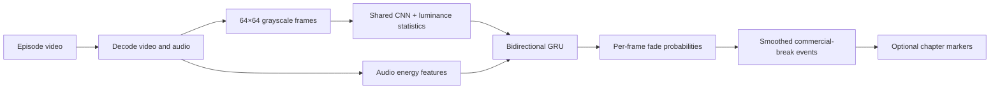

# commercial-detector-ml

`commercial-detector-ml` (CDML) finds commercial-break boundaries in episodic
video. It looks for the paired **fade to black** and **fade to silence** that
often surrounds an act break, then reports each detected fade or writes its
midpoint back into the video as a chapter marker.

It includes the complete workflow: local dataset construction, model training,
episode inference, evaluation, and chapter writing. The code and aggregate
results can be shared openly; video, audio, training caches, and visual contact
sheets must only be shared when their source material is cleared for
redistribution.

## Quick start

Install the Python dependencies and make sure `ffmpeg` and `ffprobe` are on
your `PATH`.

```bash
pip install -r requirements.txt
# CUDA 12.x example:
# pip install torch --index-url https://download.pytorch.org/whl/cu124

python -m cdml.infer --model models/fade_detector.pt --video episode.mkv
```

### Released checkpoint

The released Apache-2.0 checkpoint is hosted at
[andrew-avinante/cdml-fade-detector](https://huggingface.co/andrew-avinante/cdml-fade-detector).
Download it with the Hugging Face CLI, then supply its path to CDML:

```bash
pip install huggingface_hub
hf download andrew-avinante/cdml-fade-detector fade_detector.pt --local-dir models

python -m cdml.infer --model models/fade_detector.pt --video episode.mkv
```

Example output:

```text
episode.mkv  00:23:46.186  34228 frames  ->  3 fade(s)
  00:01:01.500 -> 00:01:05.125  (3.62s, p=0.989)
  00:11:45.125 -> 00:11:50.542  (5.42s, p=0.991)
  00:22:44.542 -> 00:22:49.750  (5.21s, p=0.990)
```

## How it works

For each eight-second window, CDML decodes 64×64 grayscale video frames and
audio features. A shared CNN reads the frames, luminance statistics capture how
dark and still they are, and log-RMS plus mel-band energies describe the audio.
A bidirectional GRU combines those signals and emits one fade probability per
frame. Overlapping-window scores are combined, smoothed, and converted into
stable fade events using hysteresis and a minimum-duration rule.



This is designed to find the transition signal, rather than recognise a
particular show, commercial, or visual style. It will be less reliable when
breaks lack the black-and-silent transition, are unusually long, occur near end
credits, or use audio/video formats unlike the training media.

## Add chapter markers

`cdml.mark_chapters` runs the detector across an episode or show directory and
remuxes chapter markers without re-encoding streams.

```bash
python -m cdml.mark_chapters "/media/Shows/Example Show" --dry-run
python -m cdml.mark_chapters "/media/Shows/Example Show" --in-place
```

By default, files that already contain chapters are skipped. Use `--existing
compare` to compare predictions against them, or `--existing replace` only when
you intend to replace the existing markers. Without `--in-place`, output is
written alongside the source as `<name>.chapters<ext>`.

## Create your own training data

Train only on media you are authorised to process. DVD and Blu-ray chapter
markers can provide useful labels for internal act breaks: CDML surveys the
markers, snaps them to the matching fades, then builds a local cache containing
three window types:

- **Positive windows:** chapter-marked commercial-break fades.
- **Hard negatives:** fades that are not chapter-marked breaks, such as scene
  transitions.
- **Easy negatives:** ordinary footage away from a fade.

Random window placement prevents the model from learning that a fade is always
in the centre of a clip. Grouped train/validation/test splits keep all clips
from an episode in the same split, avoiding episode-level leakage.

```bash
# 1. Inspect chapter coverage before spending time decoding media.
python -m cdml.chapters --shows "/media/Authorized/Example Show"

# 2. Build resumable per-episode shards.
python -m cdml.build_dataset --shows "/media/Authorized/Example Show" \
    --out data/chapters --workers 5

# 3. Assemble the local training cache.
python -m cdml.build_dataset --out data/chapters --assemble --cache cache

# 4. Inspect labels, establish a no-model baseline, and train.
python -m cdml.review --cache cache --out review
python -m cdml.baseline --cache cache
python -m cdml.train --cache cache --out runs/detector
```

The cache contains decoded frames, audio features, and labels derived from the
source media. Do not publish it, raw shards, source clips, or their metadata
unless you have explicit rights to redistribute them.

### Inspect generated contact sheets locally

`cdml.review` produces `positive.png`, `hard_negative.png`, and
`easy_negative.png` in the chosen output directory. Each row shows sampled
frames from one window; the upper bar is the label (white means break) and the
lower bar is loudness. A good positive shows the image go dark as the loudness
collapses beneath the labelled span; a hard negative looks similar but has no
break label.

The contact sheets contain sampled source frames and are intentionally generated
only for local review. They are not part of this repository or release.

## Results

The published aggregate reports are in [`results/`](results/). The main held-out
evaluation used 2,032 windows from 83 episodes across four shows. Splits were
grouped by episode, so no episode appears in more than one split.

| model | test AP | frame F1 | event F1 | missed events |
|---|---:|---:|---:|---:|
| threshold baseline | 0.7792 | 0.7255 | 0.7782 | 9 of 123 |
| **CDML detector** | **0.9823** | **0.9654** | **0.9840** | **0 of 123** |

Leave-one-show-out evaluation measures how well the detector transfers to a
show it did not see during training:

| held-out show | test AP | event F1 | recall |
|---|---:|---:|---:|
| [Show A (animated)](results/loso_show_a_report.json) | 0.9709 | 0.9545 | 1.000 |
| [Show B (animated)](results/loso_show_b_report.json) | 0.9634 | 0.9067 | 0.872 |
| [Show C (live action)](results/loso_show_c_report.json) | 0.9449 | 0.9061 | 0.967 |
| [Show D (animated)](results/loso_show_d_report.json) | 0.9313 | 0.7606 | 0.643 |

The detailed [held-out evaluation](results/evaluation_report.json) and
[training history](results/training_history.json) are also available as
machine-readable artifacts. The live-action result indicates that the model can
transfer beyond the cartoons used for training; its known weakness was the
held-out show whose break fades were much longer than those it had seen.

## Repository layout

| Path | Purpose |
|---|---|
| [`cdml/`](cdml/) | Detection, dataset construction, training, and chapter-writing package. |
| [`cdml/README.md`](cdml/README.md) | Package-level command and model reference. |
| [`models/fade_detector.pt`](models/fade_detector.pt) | Shipped Apache-2.0 detector checkpoint. |
| [`models/README.md`](models/README.md) | Checkpoint model card, license, limitations, and checksum. |
| [`results/`](results/) | Aggregate evaluation reports, split information, and training history. |
| `review/` | Ignored locally generated contact sheets; never publish them without media rights. |

## Release and reproducibility

This project can be reproduced with a corpus you are authorised to use, but the
original training examples are not a public dataset release. When releasing the
project, publish Apache-2.0 code and checkpoint, documentation, model
configuration, and sanitized aggregate metrics; keep original media, derived
caches, raw clips, source-path metadata, and contact sheets out of the public
repository. The Apache-2.0 license applies to the code and checkpoint, not to
the underlying training media.
